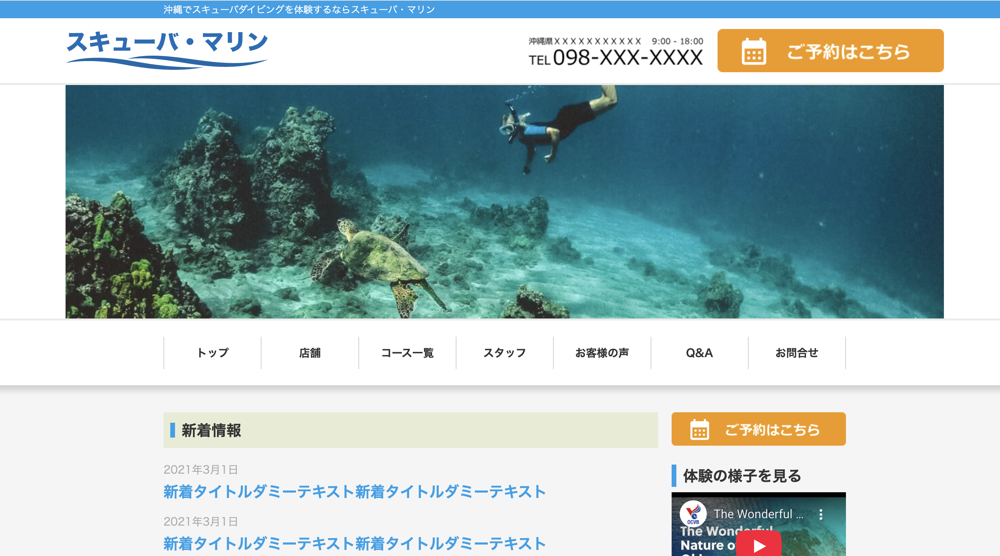

# MyPortfolio

これまでに作成したLP / HPなどをまとめています。
- codejumpはhttps://code-jump.com/ の受講課題です。
- TechEliteはhttps://stock-sun.com/techelite/ の受講課題です。

## TechElite LP

[🌐 Demo](https://gitofyano.github.io/MyPortfolio/TechEliteLP/) /
[📂 Source](https://github.com/gitofyano/MyPortfolio/tree/main/TechEliteLP) / 
1page

- **作成日：**
2025/12/01
- **概要：**
Figmaのデザインデータからパーフェクトピクセルで作成しました。初回案件でCSSは汚いですが、タイムスケジュールはflexboxで作成しレスポンシブ含めて見た目の完成度はしっかり仕上げました。

## TechElite HP

[🌐 Demo](https://gitofyano.github.io/MyPortfolio/TechEliteHP/) /
[📂 Source](https://github.com/gitofyano/MyPortfolio/tree/main/TechEliteHP) / 
Web site

- **作成日：**
2026/02/17
- **概要：**
WordPressで作成しました。CSSの可読性を向上させてスマートに作成し、formカレンダーとプラグインの目次の修飾もfigmaのデザインに一致するように作成しました。

## CodeJump 課題1

[🌐 Demo](https://gitofyano.github.io/MyPortfolio/CodeJump1/) /
[📂 Source](https://github.com/gitofyano/MyPortfolio/tree/main/CodeJump1) / 
1page

- **作成日：**
2026/03/04
- **概要：**
jQueryを使わずJavaScriptをオブジェクト指向で実装しました。

## CodeJump-課題2 

- 準備中

